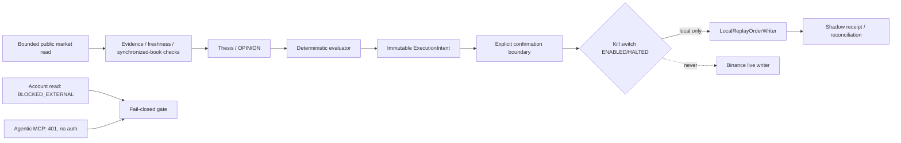

# 0-infinity

**Evidence-bounded autonomous trading for Binance Agent OS.**

This repository separates OPINION from TRADE: observation → evidence → thesis → executable edge → authority → execution. A thesis or evaluator result is not a trade. M-B8 adds a local submission/readiness boundary without enabling financial writes.

## M-B8 position

- Mode: `submission-ready-shadow/readiness`; current state: `READINESS_PREPARED / REMOTE_NOT_SYNCHRONIZED / LIVE_WRITE_NOT_AUTHORIZED`.
- Product and allowlist: Binance USD-M Futures, `BTCUSDT` and `ETHUSDT` only.
- Market evidence: bounded public bookTicker read (`LIVE_READ_PASS`); this does not prove synchronized depth, account state, profitability, or production safety.
- Account reads remain unavailable: account `BLOCKED_EXTERNAL`.
- Binance Agentic MCP status is split accurately: the historical raw HTTP probe is `UNAUTHENTICATED_PROBE` (401); the supported `mcp-remote` OAuth attempt reached discovery but is `AUTH_BLOCKED_EXTERNAL` because the server does not support dynamic client registration. No credentials or browser session were used.
- Official Binance Skills Hub source `binance/binance-skills-hub` was installed and inspected (skill v2.0.0; binance-cli 2.1.1). Credential-free BTCUSDT ticker/mark-price attempts are `BINANCE_SKILLS_PUBLIC_READ_BLOCKED_EXTERNAL` due Binance eligibility restrictions. No live Skills evidence is claimed.
- Binance Futures Testnet public exchange metadata was read successfully (`HTTP 200`), but authenticated account/order lifecycle remains `BINANCE_TESTNET = BLOCKED_EXTERNAL` because dedicated testnet credentials are unavailable.
- M-B2-G remains HTTP 451.
- `liveWrite`, cancel, transfer, withdrawal, wallet mutation, and MCP financial actions are false. The local `LocalReplayOrderWriter` can only create deterministic shadow receipts.
- Confirmation is mandatory and binds the exact immutable intent; stale, expired, anchor, or edge drift invalidates it. Denial never writes or retries.



## Verifiable reasoning

M-B8 emits a canonical JSON reasoning receipt before thesis/mandate projection. Receipts contain only references, bounded claims, assumptions, unresolved items, and invalidation conditions—never chain-of-thought. `canonicalReasoningJson` sorts object properties deterministically; `createReasoningReceipt` records SHA-256; `verifyReasoningReceipt` rejects dangling references, supporting/opposing contradictions, mutation, and digest drift. The council binds `reasoningReceiptHash` into thesis reasoning and mandate provenance without changing authority, evaluator, economics, or writer semantics. The demo includes real `APPROVE` and `REFUSE` receipts and `ZO-BIN-MB8-reasoning-verifiability.json`.


M-B1–M-B7 remain the reviewed local components; M-B7 `SHADOW_PASS` is deterministic replay evidence only. M-B8 does not upgrade that ceiling. It does not claim live exchange execution, synchronized private state, account authorization, remote submission readiness, or financial outcome. Binance emergency-stop material is documentation only and is never invoked.

## Deterministic demo

Run with no credentials and no network:

```bash
npm run demo
npm run readiness:validate
npm run secret-scan
```

The demo executes three canonical local scenarios: economics edge collapse → no trade; valid shadow execution → receipt; unknown outcome → reconciliation with no blind retry. It writes `docs/development/evidence/ZO-BIN-MB8-demo-readiness.json` and the preserved MCP receipt `docs/development/evidence/ZO-BIN-MCP-401-agentic-read-only.json`.

## Submission/video script

1. Show the architecture and the invariant **OPINION != TRADE**.
2. Run `npm run demo`; point out the refusal, shadow receipt, and unknown recovery.
3. Open the readiness artifact and capability manifest: writes are disabled, account/MCP are blocked, and the allowlist is explicit.
4. Run `npm run readiness:validate`; close by stating the evidence ceiling and the M-B2/MCP blockers. Do not present local replay as a live Binance trade.

## Static Web UI and local entrypoints

The judge-facing UI lives in `web/` and is intentionally static. Run `npm run api` for the local REST surface, `npm run mcp` for line-delimited local JSON-RPC, and `npm run web:check` for static validation. GitHub Pages publishes only `web/`; it does not host REST/MCP. Hosted deployment remains blocked until a server host and operational evidence are configured. See [`docs/WEB_UI.md`](docs/WEB_UI.md), [`docs/DEPLOYMENT.md`](docs/DEPLOYMENT.md), and [`docs/SUBMISSION.md`](docs/SUBMISSION.md).
